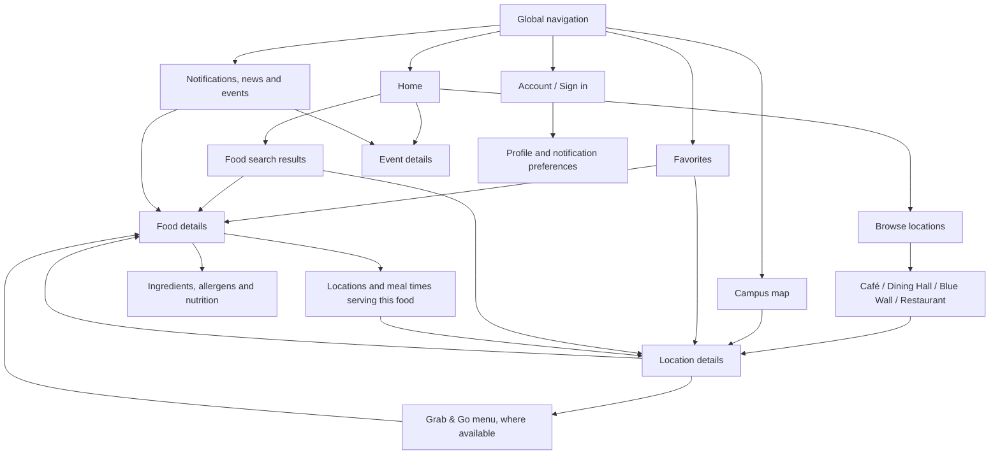

# Proposed Navigation Map

Menus and locations can be browsed without signing in.

```mermaid
flowchart TB
    NAV["Global navigation"]

    NAV --> HOME["Home"]
    NAV --> MAP["Campus map"]
    NAV --> FAV["Favorites"]
    NAV --> NEWS["Notifications, news and events"]
    NAV --> ACCOUNT["Account / Sign in"]

    HOME --> SEARCH["Food search results"]
    HOME --> LOCATIONS["Browse locations"]
    HOME --> EVENT["Event details"]

    LOCATIONS --> CATEGORIES["Café / Dining Hall / Blue Wall / Restaurant"]
    CATEGORIES --> LOCATION["Location details"]
    MAP --> LOCATION
    FAV --> LOCATION
    FAV --> FOOD["Food details"]

    SEARCH --> FOOD
    SEARCH --> LOCATION
    LOCATION --> FOOD
    LOCATION --> GRAB["Grab & Go menu, where available"]
    GRAB --> FOOD

    FOOD --> DETAILS["Ingredients, allergens and nutrition"]
    FOOD --> SERVING["Locations and meal times serving this food"]
    SERVING --> LOCATION

    NEWS --> EVENT
    NEWS --> FOOD
    ACCOUNT --> SETTINGS["Profile and notification preferences"]
```