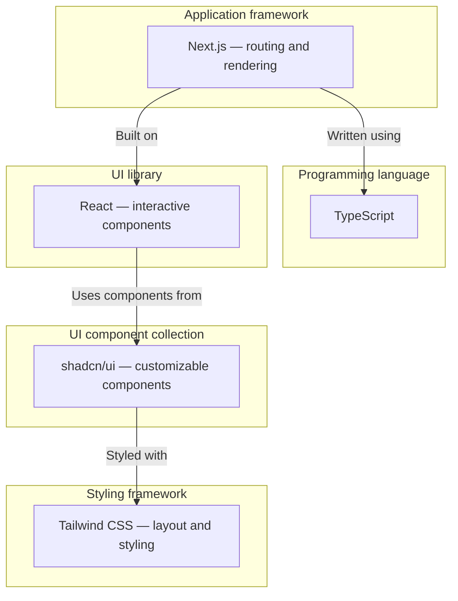

# Proposed Frontend Tech Stack

```mermaid
flowchart TB
    subgraph Language["Programming language"]
        TS["TypeScript"]
    end

    subgraph Framework["Application framework"]
        NEXT["Next.js — routing and rendering"]
    end

    subgraph Library["UI library"]
        REACT["React — interactive components"]
    end

    subgraph Styling["Styling framework"]
        TW["Tailwind CSS — layout and styling"]
    end

    subgraph Components["UI component collection"]
        SH["shadcn/ui — customizable components"]
    end

    NEXT -->|"Written using"| TS
    NEXT -->|"Built on"| REACT
    REACT -->|"Uses components from"| SH
    SH -->|"Styled with"| TW
```