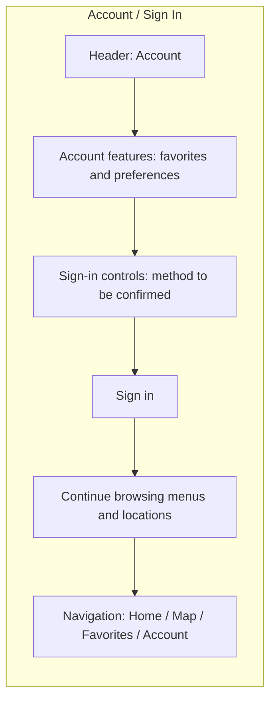
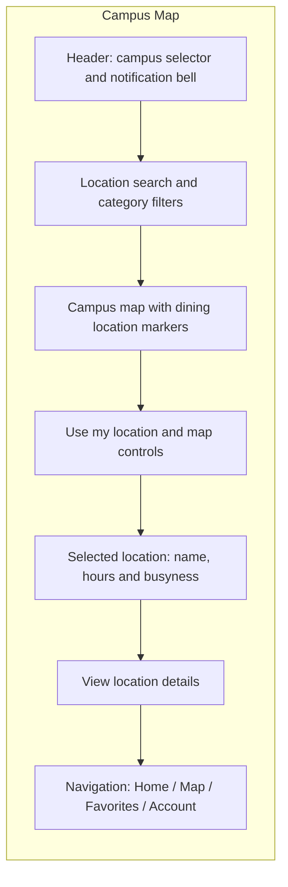
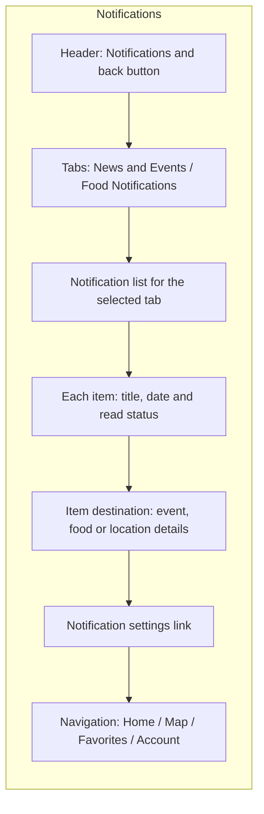
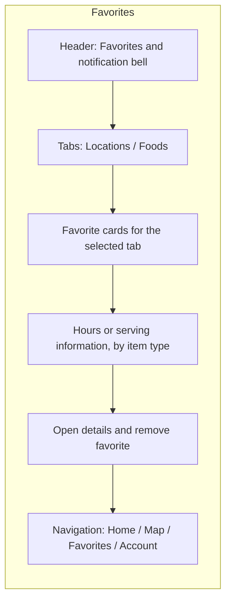

# Proposed Mobile Page Wireframes

Each column shows the content order from top to bottom.
These are structural wireframes, not final visual designs.

```mermaid
flowchart LR
    subgraph Home["Home"]
        direction TB
        H1["Header: campus selector and notification bell"]
        H2["Search food or locations"]
        H3["Favorite locations and today's menus"]
        H4["Categories: Café / Dining Hall / Blue Wall / Restaurant"]
        H5["Sort: default or nearest when location is enabled"]
        H6["Location cards: name, hours and busyness"]
        H7["Special events and occasions"]
        H8["Navigation: Home / Map / Favorites / Account"]
        H1 --> H2 --> H3 --> H4 --> H5 --> H6 --> H7 --> H8
    end

    subgraph Search["Search Results"]
        direction TB
        S1["Back button and search field"]
        S2["Campus, date and meal filters"]
        S3["Dietary and allergen filters"]
        S4["Matching food cards"]
        S5["Each card: food, location, meal and serving time"]
        S6["No matches: clear filters or edit search"]
        S1 --> S2 --> S3 --> S4 --> S5 --> S6
    end

    subgraph Location["Location Details"]
        direction TB
        L1["Back button, location name and favorite button"]
        L2["Hours, busyness and last updated time"]
        L3["Map link and distance when available"]
        L4["Date and meal selector"]
        L5["Menu by station, including Grab & Go if available"]
        L6["Food cards with dietary and allergen indicators"]
        L7["Location events and announcements"]
        L1 --> L2 --> L3 --> L4 --> L5 --> L6 --> L7
    end

    subgraph Food["Food Details Panel"]
        direction TB
        F1["Food name and favorite button"]
        F2["Serving locations, dates and meal times"]
        F3["Ingredients and reported allergens"]
        F4["Serving size and nutrition label"]
        F5["Source and last updated time"]
        F1 --> F2 --> F3 --> F4 --> F5
    end
```

## Account / Sign In

**Behavior:** This diagram shows the signed-out layout.
Sign-in success returns to the requested account feature, or opens
Profile / Preferences when Account was the entry point.
Continue browsing opens Home.
Signed-in users opening Account see Profile / Preferences.
Menus and locations remain browsable without signing in.

## Campus Map

**Behavior:** Search and category filters update the visible markers.
Categories match Home: Café / Dining Hall / Blue Wall /Restaurant.
Selecting a marker reveals the location preview and its details link.
Distance appears only when a user position is available.
Use my location requests permission when selected.
Without permission, show the selected campus and keep browsing available.

## Notifications

**Behavior:** Tabs show alternative lists. Opening an item goes to the
relevant event, food, or location details screen.
Read/unread indicators can be optional.
Notification settings opens the notification controls within
Profile / Preferences. If those controls require an account,
show the sign-in entry first.

## Favorites

**Behavior:** Show cards for the selected tab. Location cards show name, hours, open/closed status, and busyness. Food cards show name and available serving locations, dates, and meal times.
Opening a card goes to its existing details screen.
Removing a favorite updates the list and reports a failure if the change cannot be saved.
